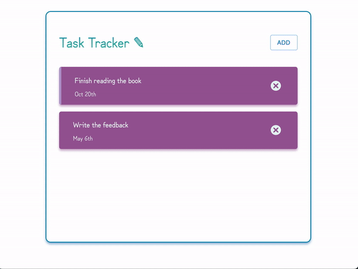

## Task Tracker 📝

A simple task tracker app made with `React` ⚛

### Description

- The app provides a simple interface to see and add new tasks.
- The form to add a task is hidden when first entering the app. The user can open it through the `ADD` button.
- By _double-clicking_ on a task, the user can add a reminder (vertical line).
- Each task can be deleted by clicking on the `❎` button.

### Demo 📼

### Development vs Production build 🧱

- `npm start` to run server locally
- to run a production build in a separate server:
  - `sudo npm i -g serve` -> basic http server
  - `serve -s build -p 8000` -> specify a different port for the production build

### `JSON` server - fake backend 🤷‍♀️

- install `npm i json-server`
- add to _package.json_ -> `"server": "json-server --watch db.json --port 5000"`
- run server -> `npm run server`

### Using `React Router`

- npm i react-router-dom
